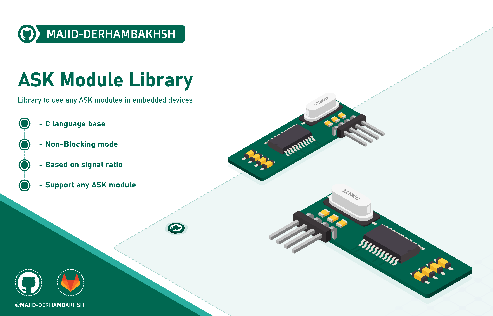

# ASK-Decoder
ASK module library for microcontrollers

> #### Based on: [Sisoog Algorithm](https://github.com/Sisoog/4Ch_learnRemote)  

## Release
- #### Version : 0.0.0

- #### Type : Embedded Software.

- #### Support :  
               - Any microcontrollers  

- #### Program Language : C/C++

- #### Properties :

- #### Changes :  

- #### Required Library/Driver :


## Overview 
### Initialization and de-initialization functions:
```c++
non
``` 

### Operation functions:
```c++
uint8_t ASK_IsValidRemote(ASK_TypeDef *ASK);

uint32_t ASK_GetRemoteCode(ASK_TypeDef *ASK);

void ASK_GetRemoteInfo(ASK_TypeDef *ASK, uint32_t *RemoteID, uint8_t *PressedKey);

/* ::::: ISR Handling ::::: */
void ASK_ISRHandle_Rising(ASK_TypeDef *ASK);

void ASK_ISRHandle_Falling(ASK_TypeDef *ASK);
``` 

### Macros:
```c++ 
/* ~~~~~~~~ Timer ~~~~~~~~ */
#define _ASKTimer_GetTick()   Timer1_GetTick()
#define _ASK_TIMER_MAX_TICK   UINT16_MAX

/* ~~~ ASK sensitivity ~~~ */
#define _ASK_USE_LOW_SENSITIVITY
```

## Guide

#### This library can be used as follows:
#### 1.  include ask_decoder.h header and add ask_decoder.c source in your project  
#### 2.  Config library parameters in ask_decoder_conf.h header, for example:  
  ```c++  
  /* ~~~~~~~~~~~~~~~ Include files ~~~~~~~~~~~~~~~ */
  /* PGMSPACE header */
  #include <avr/pgmspace.h>
  
  /* Timer header */
  #include "timer.h"
  
  /* HAL or MCU header */
  #include <avr/io.h>
  
  /* ~~~~~~~~~~~~~~~~~~ Options ~~~~~~~~~~~~~~~~~~ */
  /* ~~~~~~~~ Timer ~~~~~~~~ */
  #define _ASKTimer_GetTick()   Timer1_GetTick()
  #define _ASK_TIMER_MAX_TICK   UINT16_MAX
  
  /* ~~~ ASK sensitivity ~~~ */
  #define _ASK_USE_LOW_SENSITIVITY
  
  ``` 
#### 3.  Create ASK_TypeDef object, for example:      
  ```c++  
  ASK_TypeDef RF433;
  ``` 
#### 4.  Initialize a timer (16bit or 32bit) with 1MHz or 2MHz frequency      
#### 5.  Initialize an external interrupt in Falling/Rising edge mode    
#### 6.  Add ASK_ISRHandle_Rising/ASK_ISRHandle_Falling in interrupt function, for example:      
  ```c++  
  ISR(INT4_vect)
  {
      if (GPIO_ReadPin(&PORTA, GPIO_PIN_4) == 1)
      {
          ASK_ISRHandle_Rising(&RF433);
      }
      else
      {
          ASK_ISRHandle_Falling(&RF433);
      }
  }
  ``` 
#### 7.  Using operating function, for example:      
  ```c++  
  int main(void)
  {
      uint8_t key;
      uint32_t id;
      
      while (1)
      {
          if (ASK_IsValidRemote(&RF433) == 1)
          {
              ASK_GetRemoteInfo(&RF433, &id, &key);
              printf("RemoteID:%u --- Key:%u", id, key);
          }
      }
  }
  ``` 
      
## Examples  

#### Example 1: Remote detecting with Atmega64a
```c++  
#include <avr/io.h>
#include <avr/interrupt.h>

#include "ask_decoder.h"

ASK_TypeDef RF433;

int main(void)
{
    uint8_t key;
    uint32_t id;
    
    /* Serial initialize */
    UART0_Init(9600);
    
    /* External Interrupt GPIO */
    DDRE  = 0x00;
    PORTE = (1 << PORTE4);
    
    /* External Interrupt Config */
    EICRB = (1 << ISC40); // Set EXTI4 in any change mode
    EIMSK = (1 << INT4); // Enable EXTI4
    
    asm("sei"); // Enable global interrupt
    
    while (1)
    {
        if (ASK_IsValidRemote(&RF433) == 1)
        {
            ASK_GetRemoteInfo(&RF433, &id, &key);
            printf("RemoteID:%u --- Key:%u", id, key);
        }
    }
}

ISR(INT4_vect)
{
    if (((PINE >> PORTE4) & 0x01) == 1)
    {
        ASK_ISRHandle_Rising(&RF433);
    }
    else
    {
        ASK_ISRHandle_Falling(&RF433);
    }
}
   
``` 

## Tests performed:
- [x] Run on STM32 Fx cores 
- [x] Run on AVR 

## Developers: 
- ### Majid Derhambakhsh
